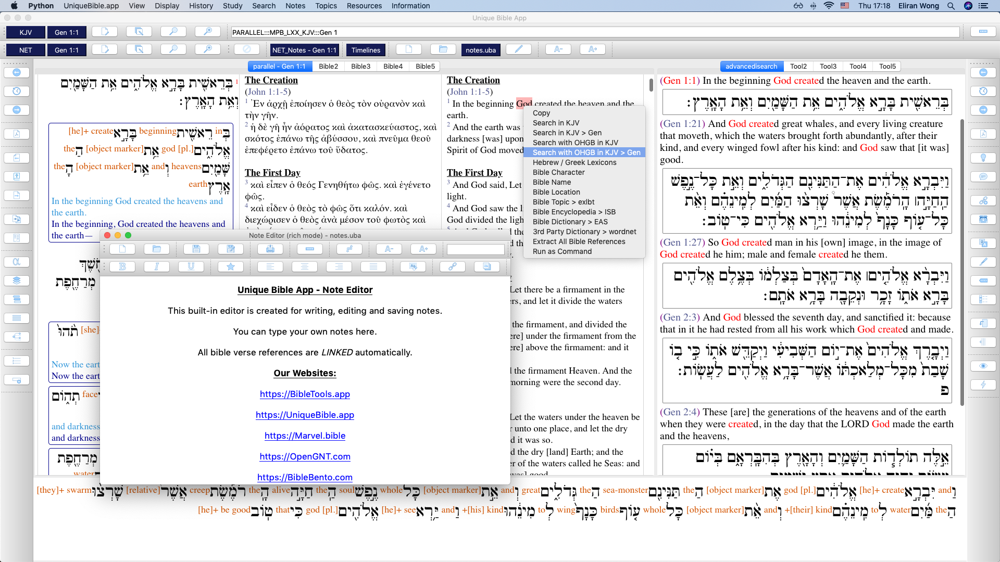

# UniqueBible
A cross-platform & offline bible application, integrated with high-quality resources and unique features.

<b>Tested in:</b> <a href="https://github.com/eliranwong/UniqueBible/wiki/Install-on-Windows">Windows 10</a>, <a href="https://github.com/eliranwong/wsl2/blob/master/bible_apps/desktop.md">Windows WSL2</a>, <a href="https://github.com/eliranwong/UniqueBible/wiki/Install-on-macOS">macOS [Sierra+]</a> and <a href="https://github.com/eliranwong/UniqueBible/wiki/Install-on-Linux">Linux</a> (Debian, Ubuntu & Mint), <a href="https://github.com/eliranwong/UniqueBible/wiki/Install-on-Chrome-OS">Chrome OS</a> (Debian 10)

Visit <a href="https://BibleTools.app" target="_blank">https://BibleTools.app</a> for further other bible tools we develop.

# Development Team

Eliran Wong (https://github.com/eliranwong)

Oliver Tseng (https://github.com/otseng)

<a href="https://github.com/eliranwong/UniqueBible/wiki/Translators">Program Interfacce Translators</a>

# Screenshot:

# Automatic Setup

You can simply download & run UBA if you have python in place, read our examples at:

https://github.com/eliranwong/UniqueBible/wiki/Installation

# Features, instructions and how-tos

[Wiki](https://github.com/eliranwong/UniqueBible/wiki)

# Help, discussion and support

[Discussions](https://github.com/eliranwong/UniqueBible/discussions)

# Feature requests, issues and bug reporting

[Issues](https://github.com/eliranwong/UniqueBible/issues)

# Donations:

Please consider a donation via our PayPal account:
<a href="https://www.paypal.me/MarvelBible">https://www.paypal.me/MarvelBible</a>

