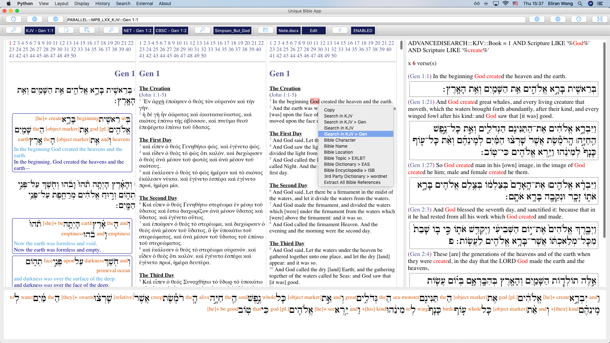

# UniqueBible
A cross-platform & offline bible application, integrated with high-quality resources and unique features.

<b>Tested in:</b> Windows, macOS and Linux (Ubuntu & Mint)

(developed with Python [version: 3.7.2])

Visit <a href="https://BibleTools.app" target="_blank">https://BibleTools.app</a> for further information.

# Installation

Install python (version 3.6+)

# Install Dependencies

pip3 install PySide2
 (PySide2 is required for graphical user interface, used by UniqueBible.app.)

pip3 install PyPDF2
 (PyPDF2 is required for reading text from *.pdf documents.)

pip3 install python-docx
 (python-docx is required for reading text from *.docx documents.)

pip3 install gdown
 (gdown is required for downloading database files stored in google drive.)

# Download & Run UniqueBible.app

Use the download button on this page to download a zip copy.

Unzip your folder and run the following command in command prompt:

python3 main.py

# Where are the Database Files?

All codes for running the app is shared in this repository.

Github has restrictions on upload size.  For this reason, full set of database files is not able to be uploaded here.

To run UniqueBible.app and its features, several database files are required.  To help you about installing particular datasets, <b>"Download Helper"</b> comes up automatically, when a database file is needed for a particular feature.

You can also manually install <b>"ALL"</b> https://marvel.bible datasets via our menu bar. 
Go to "Resources" > "Install Marvel.bible Datasets"

<i><b>Remarks:</b></i> It takes time for large files to be downloaded.  The core datasets for running UniqueBible.app is 49MB in size.  You may need to wait for a while for downloading it after you first launched UniqueBible.app.

In ADDITION to official UniqueBible.app data, we support various <b>3rd party modules</b>.  Please see <a href="https://github.com/eliranwong/UniqueBible#3rd-party-resources">below</a> for details.

# Screenshot:

# 3rd Party Resources

In addition to Marvel.bible modules and datasets, UniqueBible.app has a built-in converter. 
The built-in converter supports import of the following third-party modules: 

* MySword Bible Modules (<a href="https://mysword.info/download-mysword/bibles">https://mysword.info/download-mysword/bibles</a>)

* MySword Commentary Modules (<a href="https://mysword.info/download-mysword/commentaries">https://mysword.info/download-mysword/commentaries</a>)

* MySword Dictionary Modules (<a href="https://mysword.info/download-mysword/dictionaries">https://mysword.info/download-mysword/dictionaries</a>)

* e-Sword Bible Modules [Apple / macOS / iOS (*.bbli)] (<a href="https://www.e-sword.net">https://www.e-sword.net</a>)

* e-Sword Commentary Modules [Apple / macOS / iOS (*.cmti)] (<a href="https://www.e-sword.net">https://www.e-sword.net</a>)

* e-Sword Dictionary Modules [Apple / macOS / iOS (*.dcti)] (<a href="https://www.e-sword.net">https://www.e-sword.net</a>)

* e-Sword Lexicon Modules [Apple / macOS / iOS (*.lexi)] (<a href="https://www.e-sword.net">https://www.e-sword.net</a>)

* MyBible Bible Modules (<a href="https://www.ph4.org/b4_my.php?k=bibles&q=mybible">https://www.ph4.org/b4_my.php?k=bibles&q=mybible</a>)

* MyBible Commentary Modules (<a href="https://www.ph4.org/b4_my.php?k=commentaries&q=mybible">https://www.ph4.org/b4_my.php?k=commentaries&q=mybible</a>)

* MyBible Dictionary Modules (<a href="https://www.ph4.org/b4_my.php?k=dictionary&q=mybible">https://www.ph4.org/b4_my.php?k=dictionary&q=mybible</a>)

* More MySword / e-Sword modules are available at: <a href="http://www.biblesupport.com">http://www.biblesupport.com</a>

<b>Disclaimer</b>: All third party modules are created by third parties.  In NO way one should suggest that UniqueBible.app endorse their views or individual content.  For issues about these third-party modules, please contact corresponding third-parties.  UniqueBible.app is NOT responsibile for any of these third-party modules in terms of their quality or content.  Users should use these modules at their own judgement and risks.

Users need to download 3rd party modules separately. 
Built-in converter can be accessed via our menu bar: 
Go to menu "Resources" > "Import 3rd Party Modules"

# Donations:

Please consider a donation via our PayPal account:
<a href="https://www.paypal.me/MarvelBible">https://www.paypal.me/MarvelBible</a>

