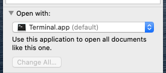

# Example: Install & Run on macOS / Linux

There are different ways to install.  Below is an example.

# 1. Download & Install a Python Distribution First

Go to https://www.python.org/downloads/

Download a version 3.6+

# 2. Download a copy of UniqueBible.app

Use the download button on this page to download a zip copy. 

The following steps assume that your downloaded file is located in "Downloads" of your home directory, i.e. ~/Downloads/. 

# 3. Open your Terminal

On Linux, open a terminal app

On mac, open "Applications > Utilities > Terminal.app"

# 4. Enter Commands

> cd ~ 
> unzip ~/Downloads/UniqueBible-master.zip 
> cd UniqueBible-master 
> python3 -m venv venv 
> source venv/bin/activate 
> pip3 install PySide2 
> pip3 install PyPDF2 python-docx gdown diff_match_patch langdetect pygithub qt-material pypinyin opencc telnetlib3 ibm-watson babel

# 5. Run the app

if you keep the terminal open after step 3, enter:

> python3 main.py 

if you open a new session, enter:

> cd ~/UniqueBible-master 
> source venv/bin/activate 
> python3 main.py 

# 6. Create a Shortcut File for Double-clicking on macOS

There are different ways to create a shortcut, below is an example.

Create a plain text file, e.g. UniqueBible.sh, and place on your desktop.

Paste the following lines in the file and save changes:

> cd ~/UniqueBible-master 
> source venv/bin/activate 
> python3 main.py 

Open your terminal and enter:

> chmod +x ~/Desktop/UniqueBible.sh

On mac, right click the file UniqueBible.sh, select "Get Info".

In the section "Open with:", select "Terminal.app" as default.

Now, you can double-click the file "UniqueBible.sh" to run the app directly.

# 7. Create a Shortcut on Linux

Create a plain text file /usr/share/applications/UniqueBibleApp.desktop

For example, if you use nano,

> sudo nano /usr/share/applications/UniqueBibleApp.desktop

Paste the following content, but replace your_username with your usename on your device

> [Desktop Entry] 
> Version=1.0 
> Type=Application 
> Terminal=false 
> Path=/home/your_username/UniqueBible-master/ 
> Exec=python3 /home/your_username/UniqueBible-master/main.py 
> Icon=/home/your_username/UniqueBible-master/htmlResources/UniqueBibleApp.png 
> Name=Unique Bible App 

Saves changes by pressing "Ctrl + O"

Exit nano by pressing "Ctrl + X"
