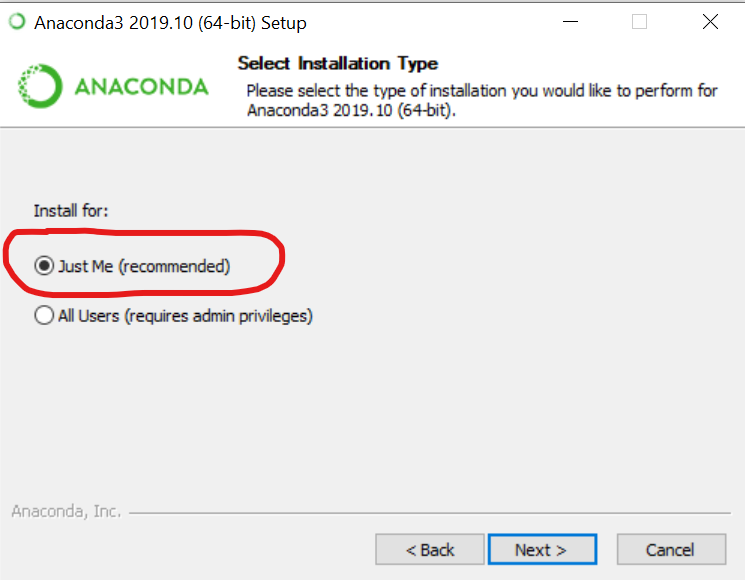
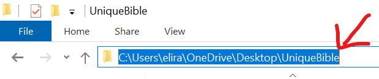
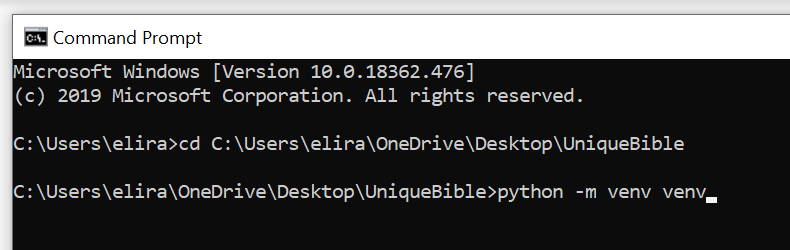
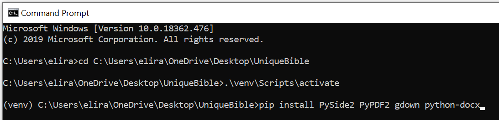

# Installation on Windows - An Example

There are different ways to install python library and dependencies.  Below is an example using Anaconda python distribution.

# 1. Download a Python distribution

Go to https://www.anaconda.com/distribution/ and download a windows version of python distribution version 3.x

# 2. Run Anaconda installer

To avoid writting permission, it is easier to select option "just for me"

To make running the app easier, it is suggested to select "add path ..." option, as indicated below.

# 3. Download UniqueBible

Go to https://github.com/eliranwong/UniqueBible, use the download button to download a zip copy.  Unzip it and place in a location you like.

